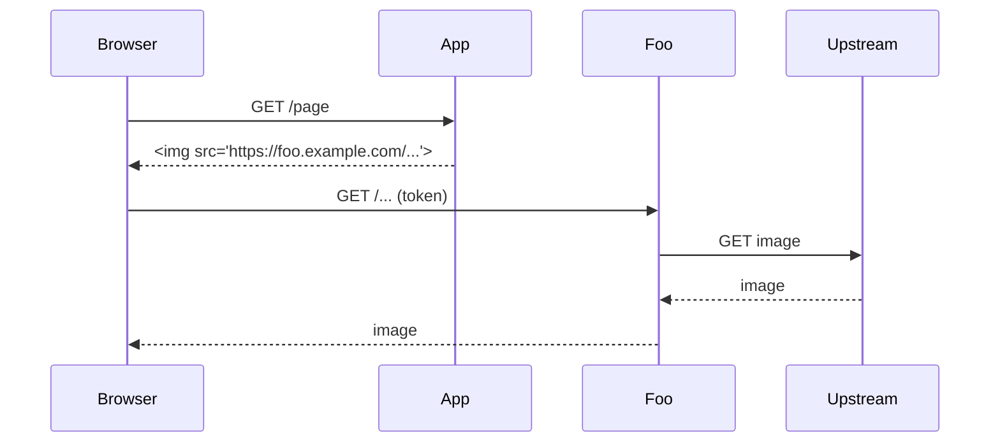

# Foo - image proxy with authentication

Foo is an HTTP reverse proxy that serves third-party images over HTTPS from your own origin. Heavily inspired by [atmos/camo](https://github.com/atmos/camo), but images are served only to authenticated users of your application, using a per-user token in addition to signed URLs.

If your application only embeds images from a fixed set of hosts, a CSP `img-src` allowlist is simpler and this service may not be for you.

## How it works

1. Your application rewrites `` into a Foo URL signed with a shared key.
2. The browser requests the Foo URL with a short-lived token cookie.
3. Foo verifies the signature and token, fetches the upstream image, and streams it with sanitized headers.



## Installation

### Docker

```
docker run -p 3000:3000 -e FOO_SIGNING_KEY=... ghcr.io/OWNER/foo:latest
```

### From source

```
cargo build --release
```

## Configuration

All configuration is via environment variables.

- `FOO_SIGNING_KEY` (required): shared key for URL signatures, base64 encoded
- `FOO_ALLOWED_ORIGINS` (default: none): comma-separated origins allowed to embed images
- `FOO_TOKEN_TTL` (default: `300`): lifetime of the token cookie in seconds
- `FOO_MAX_LENGTH` (default: `10485760`): maximum upstream response size in bytes

See [docs/deployment.md](./docs/deployment.md) for running behind a CDN.

## Security Model

- Foo trusts only URLs signed by the application key.
- Upstream responses other than `image/*` are rejected.
- Foo never forwards cookies or credentials to upstream hosts.

Report vulnerabilities as described in [SECURITY.md](./SECURITY.md).

## Caveats

- Upstream hosts resolving to private addresses are refused. There is no allowlist override.
- Animated images are passed through unmodified.

## Development

```
cargo test
```

## License

MIT License
